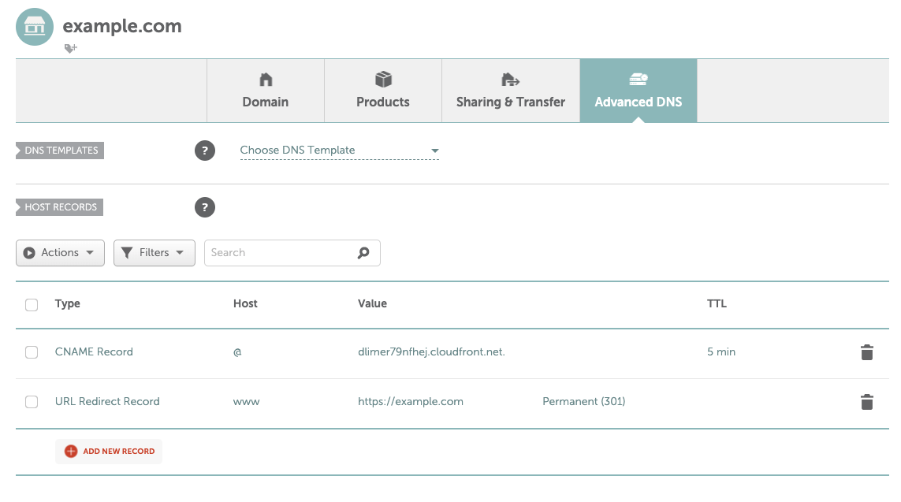

# Cloudfront Static Site

Deploy a static site to AWS using CloudFront and S3 without using Route53.

Deployment is separated into 2 stages as your domain DNS records need to be updated before the Cloudfront distribution can be updated with your domain name. 

This is because the SSL cerfiticate cannot be validated until your there is a domain DNS record pointing to the Cloudfront distribution. 

# Usage

## Requirements
- Terraform (>v1.0.0)
- jq (`brew install jq`)

## Stage 1

1. Update `variables.sh` and load environmental variables:
```
source variables.sh
```

2. Replace and add your static website contents to `src` folder using the following command. The distribution will look for `index.html` and `404.html` pages. Make sure you have those.
```
make deploy_site
```

When completed, something like the following will be outputted:
```
Outputs:

cloudfront_domain = "dlimer79nfhej.cloudfront.net"
cloudfront_id = "E1OCMS13EZXD67"
origin_identity_id = "E2N2N3D6EAWCON"
```

Your site is now available at the `cloudfront_domain`.

This is the only stage required if you don't wish to have a custom domain.
Otherwise proceed with Stage 2. We will be using the `cloudfront_id` output value.


## Stage 2

3. Add an `@` CNAME record to your domain using the `cloudfront_domain` above and add a `www` URL Redirect record pointing to your domain:



4. Add outputs from the previous stage to environmental variables:
```
source outputs.sh
```

5. Run the following to add your custom domain to your Cloudfront distribution: 
```
make update_distribution
```
During this stage you will recieve an email to verify the certificate.
Open the email and approve the validation request.

This step make take several minutes to complete.

Once complete, your site will be available using your domain.


## Updating Site Content

If changes are made in the `src` folder, run the following to upload the changes to your S3 bucket:
```
make upload_site
```
This will also be run when contents are pushed to the repo with changes in the `src` folder.

## Destroying the Site

To destroy EVERYTHING to do with this deployment:
```
make destroy &&
make distribution_destroy
```
And confirm the steps.
S3 buckets, Cloudfront distributions and certificates will be deleted!